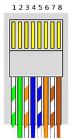

# RAPSBERRY pico

# Zapojení

Každý senzor na samostatném GPIO.
Takže mě už nezajímají adresy čidel - prostě první čidlo (GPIO1) je koupelna a je to tak vždy.

Komunikace **1W** využívá aktivní čekání, takže vyčtení teploty, zahájení měření teploty atd. trvá nějakou (ne malou) dobu. Proto je kód s komunikací **1W** umístěn do druhého jádra procesoru.

Vyčtení teploty a počet senzorů připojených na sběrnici (na jedé sběrnici by správně měl být připojen max. 1 senzor) musí být chráněno mutexem protože přistupuji z jiného procesoru.

Skenování senzorů je prováděno na začátku a potom periodicky (10min).

Měření je prováděno každých 10s.

Komunikace modbusem je potom v hlavním vlákně.

## Schéma desky

|Vodič|**modbus**|**Čidla DS18b20**|
|-|-----|-|
|1| VDD | VDD|
|2| VDD | VDD|
|3|  -  |  x |
|4|485-A|Data|
|5|485-B|Data|
|6|  -  |  x |
|7| GND | GND|
|8| GND | GND|

[eagle schéma](flash.sh)

## One wire:
Kod převzat z projektu [zde](https://github.com/adamboardman/pico-onewire/tree/main)

